# deep_learning_challenge
Unit 21 Homework: Charity Funding Predictor

#
## Overview:

The nonprofit foundation Alphabet Soup wanted a tool that can help it select the applicants for funding with the best chance of success in their ventures.

Using machine learning, neural networks, and the features in the supplied dataset we were able to create a binary classifier that can predict whether applicants will be successful if funded by Alphabet Soup.

The data supplied contained more than 34,000 organisations that have received funding from Alphabet Soup over the years.

#
## Results:

I ran 6 different models in an attempt to optimise the model and achieve accuracy greater than 75% .  This was achieved against the test data in V4 and V5 with an accuracy of 76% when the feature "names" was re-included and binned.  

#
### Data Preprocessing: 

* The variable 'IS_SUCCESSFUL' is the target for the model?
* The variables that were features for your model included:
* APPLICATION_TYPE, 
    * AFFILIATION, 
    * CLASSIFICATION, 
    * USE_CASE, 
    * ORGANIZATION, *
    * STATUS, 
    * INCOME_AMT, 
    * SPECIAL_CONSIDERATIONS, 
    * ASK_AMT , &
    * NAME (in V2, V3, V4 and V5)
- The variable 'EIN' and 'NAME' were removed from the input data in V1.  In V2, V3, V4 & V5 'NAME was included in the features.

#
### Compiling, Training, and Evaluating the Model
#
#### Starting Hyperparameters
- 2 Hidden Layers - A Good starting point for deep learning model optimisation
- 30 Neurons - 3x the starting input features
- ReLU function - accepted as a good staring point.
#
Optimisation Steps

#### V1 
* 2 Hidden Layers
* 30 neurons in each layer
* ReLU Function for both layers
* 8575/8575 - 0s - loss: 0.5588 - acc: 0.7317 on the test data.
#### Plots Showing Training Results V1
#
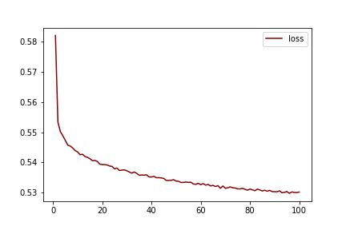 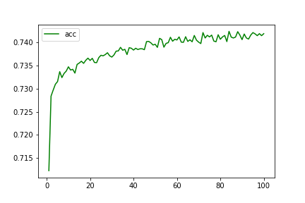

#### V1-1
* 2 Hidden Layers
* Increased to 120 neurons in each layer
* ReLU Function for both layers
* loss: 0.5848 - acc: 0.7301 on the test data.
#### Plots Showing Training Results V1-1
#
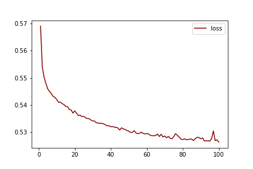 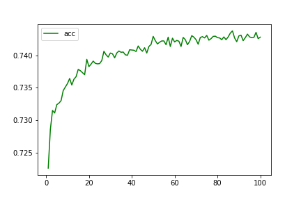

#### Observations
* No significant change by increasing neurons.

#
#### V2 - Retained NAME feature
* 2 Hidden Layers
* 30 neurons in each layer
* ReLU Function for both layers
* loss: 0.5875 - acc: 0.6241 on the test data.
#### Observations
* Significant drop in accuracy on the test data.
* Training scores are extreamly high indicating overfitting.
#### Plots Showing Training Results V2
#
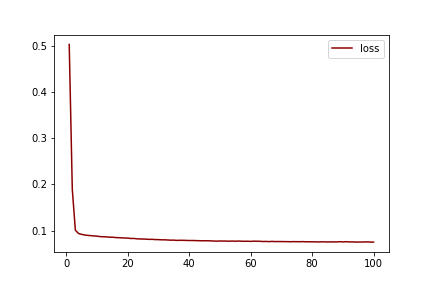 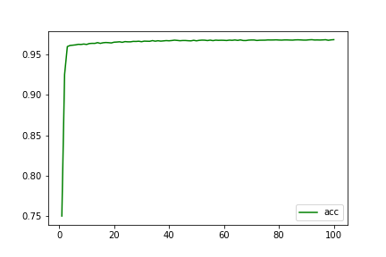

#
#### V3 - binned the NAME feature (<40)
* 2 Hidden Layers
* 30 neurons in each layer
* ReLU Function for both layers
* loss: 0.4928 - acc: 0.7583 on the test data.
#### Observations
* Accuracy of greater than 75% achieved.
#### Plots Showing Training Results V3
#
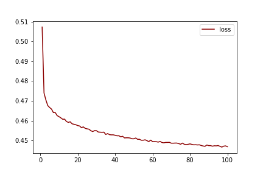 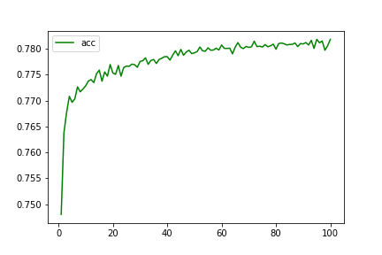

#
#### V4 - added an extra hidden layer
* 3 Hidden Layers
* 30 neurons in each layer
* ReLU Function for 3 hidden layers
* loss: 0.5019 - acc: 0.7614 on the test data.
#### Observations
* Accuracy of greater than 76% achieved.
#### Plots Showing Training Results V4
#
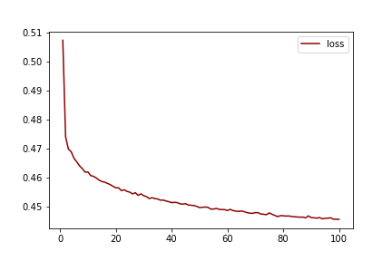 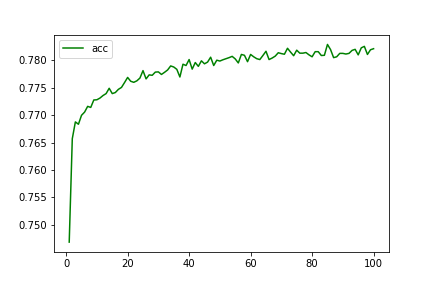

#
#### V5 - added an extra hidden layer
* 4 Hidden Layers
* 30 neurons in each layer
* ReLU Function for 4 hidden layers
* loss: 0.5076 - acc: 0.7587 on the test data.
#### Observations
* Accuracy of greater than 76% achieved but less that V4.
#### Plots Showing Training Results V5
#
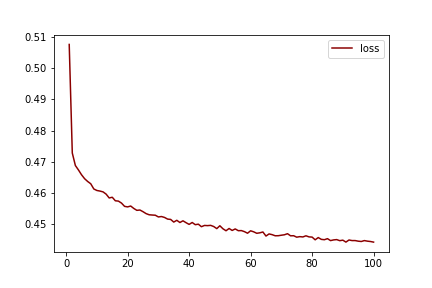 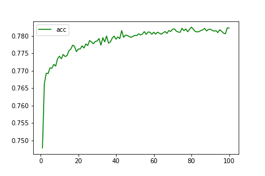

#
#### V6 - Changed Function - Removed a hidden layer.
* 3 Hidden Layers
* 30 neurons in each layer
* Sigmoiod Function for 3 hidden layers
* loss: 0.4869 - acc: 0.7562 on the test data.
#### Observations
* Accuracy of greater than 75% achieved but less that V4 and the same as using ReLU.
#### Plots Showing Training Results V6
#
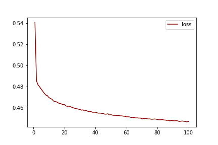 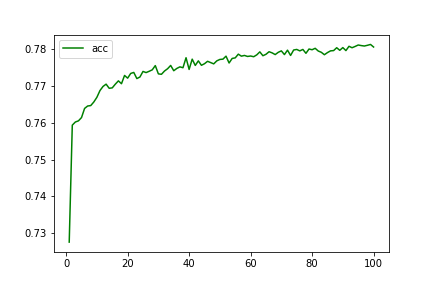

#
### Summary

We were able to achive the targeted accuracy of at least 75%.  Although many differnet hyperparameters were used the data did not significantly improve from the initial settings.  
Adding NAME and appling binning to it saw the greatest jump in the accuracy.  

* An alternative model like a Random Forest Classifier may be more appropriate for this dataset.  The reasoning for this is that it is widely accepted that RFC is used in the banking world for credit modeling and this data set may have similarities to this.    

DM
#

